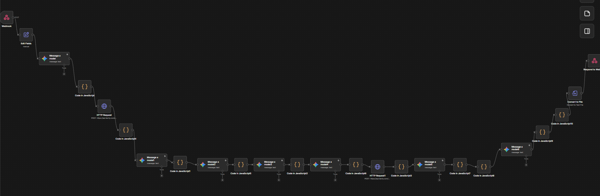

# 🧠 AI PRD Research & Generator

An AI-powered **product research and PRD generation workflow built with n8n, LLMs, JavaScript, and web research**.

The workflow takes a product/company brief, researches the market and users, extracts structured evidence, identifies pain points and unmet needs, discovers product opportunities, performs deeper validation research, and prepares the final PRD for delivery.

---

## 🚀 Project Overview

The goal of this project is to transform a simple product research brief into **evidence-backed product opportunities and a structured PRD**.

The workflow combines:

- **n8n** for workflow orchestration
- **LLMs** for research planning, synthesis, and PRD generation
- **HTTP Requests** for external web research
- **JavaScript** for query generation, batching, and data transformation
- **Structured evidence extraction**
- **Pain-point and opportunity analysis**
- **Deep product validation research**
- **File generation and webhook response**

Instead of directly generating a PRD from a prompt, the workflow follows a research-first approach.

---

## 🔄 Workflow

## 📸 n8n Workflow



The overall workflow is:

**Product Brief → Research Queries → Web Research → Evidence → Pain Points → Opportunities → Deep Research → PRD → File Output**

### What happens in the workflow?

1. The workflow receives a product/company research request through a **Webhook**.
2. The request is normalized using **Edit Fields**.
3. An LLM generates research queries across multiple research categories.
4. JavaScript converts those queries into executable search requests.
5. HTTP requests collect external research.
6. Another LLM extracts structured evidence from the research.
7. The workflow synthesizes customer pain points, unmet needs, competitor gaps, and market signals.
8. Product opportunities are generated and scored.
9. A second research phase generates deeper validation queries.
10. Additional web research is performed.
11. The downstream workflow uses the research to generate the final PRD.
12. The generated content is converted into a file and returned through the webhook.

---

# 📥 Input

The workflow starts with a product/company research brief.

Example input from the analyzed execution:

```json
{
  "product_or_company": "District Zomato",
  "market": "Global",
  "additional_context": "Research opportunities to make planning trips with groups easier"
}


```
# 📄 Output

# Unified Collaborative Group Event, Dining, and Trip Planning Platform

**Document Type:** Product Requirements Document

**Status:** Draft — Evidence-Based

---

## 1. Executive Summary

**Problem:** Organizing group trips and dining is highly fragmented and time-consuming. Diners spend an average of 17 hours discovering and booking venues, resulting in a 42% abandonment rate due to booking hassles and endless back-and-forth communication. Event planning is heavily administrative, with organizers spending 25-30 hours per event, 60-70% of which is consumed by repetitive coordination, logistics, and documentation. Furthermore, group expense splitting faces severe adoption friction when participants are forced to download new apps or create accounts, while existing split-billing tools impose daily transaction caps on free tiers and lack standard spreadsheet exports.

**Target Users:** Primary target users are group trip planners, dining coordinators, and social event organizers. Secondary users are the group participants, guests, and diners who experience choice overload, decision fatigue, and friction during payments.

**Why It Matters:** Simplifying the booking and planning process has immense market potential; 68% of consumers state they would organize more events if the process were easier. Resolving decision fatigue prevents cognitive overload, and removing application-download requirements during bill-splitting removes major social friction among companions.

**Product Direction:** We propose a unified, real-time collaborative planning and discovery marketplace. It integrates instant private dining booking with party size, neighborhood, and cuisine filters; a real-time collaborative Google Docs-style itinerary builder; intelligent seating arrangement tools constrained by relationship clusters and safety-capacity caps; and frictionless, account-free web access for instant split-payment settlements on-site.

**Evidence Summary:** Our direction is validated by benchmarks showing that event-planning administrative loads take 60-70% of a planner's time, and dining venue discovery takes 17 hours with a 42% booking abandonment rate. It is supported by technical evidence proving the viability of CRDT-based offline-capable collaborative editing, the efficiency of WebSockets over XMPP, and the success of account-free browser links for split-billing.

## 2. Problem Statement

**Core Problem:** Group event organizers lack a unified, collaborative, and seamless solution to discover group dining venues, build structured itineraries, arrange safe seating, and split expenses without suffering from administrative fatigue, tool fragmentation, and participant adoption friction.

**Affected Users:** Group trip leaders, social event planners, dining party coordinators, and their respective group participants or guests.

**Current Experience:** Organizers currently cobble together a fragmented stack of tools including spreadsheets, word documents, digital maps, email chains, WhatsApp groups, and Slack channels to plan. They manually manage seating dynamics and capacity limitations, search multiple sites to discover group dining, and use basic bill-splitting apps where they must manually enter expenses (often blocked by free-tier daily caps) and chase down friends for post-meal bank transfers.

**Why the Current Experience Fails:** This highly manual experience requires plan reorganization from scratch for every new trip. Chat tools (like WhatsApp) fail to compile, structure, and preserve detailed itineraries or booking records. Forcing all group members to download a dedicated application and register an account just to split a bill creates immense social resistance, and current dining discovery friction leads 42% of users to completely abandon bookings.

### Supporting Evidence

- Planners spend 25-30 hours per event, with 60-70% of the workload taken up by repetitive administrative coordination, documentation, and logistics.
- Diners spend an average of 17 hours to discover and book a venue for private and group dining; 42% have abandoned booking entirely due to online hassle.
- Splitwise restricts free-tier users with a daily entry cap of 3 to 4 expenses, and casual-tier split tools lack spreadsheet data export options.
- Fragmented tools force planners to reorganize trip details from scratch for every new outing.

## 3. Goals & Non-Goals

### Goals

- Reduce the average group dining discovery and booking time below the current 17-hour benchmark.
- Decrease the booking abandonment rate of group dining events below the current 42% baseline.
- Eliminate guest registration friction by enabling expense coordination and split settlement via web browser links without forced application downloads.
- Minimize administrative planning overhead by providing an integrated, conflict-free collaborative itinerary editor.
- Provide intelligent seating chart layouts that default to comfortable venue safety limits of 80-90% maximum capacity.

### Non-Goals

- Developing native peer-to-peer payment processing rails (instead we integrate with existing payment structures where no direct P2P details change hands).
- Designing short-term e-commerce retention communication flows (such as post-purchase emails sent 3-7 days later) because the travel industry booking interval is documented at a long average of 312 days.
- Utilizing XMPP-based XML communication protocols due to high transmission overhead compared to flexible WebSockets.

## 4. Success Metrics

### Primary Metrics

#### 1. Group Dining Booking Abandonment Rate

**Why It Matters:** Tracks the direct reduction in user friction and back-and-forth communication hassle that currently leads 42% of users to abandon bookings.

**Measurement Method:** Calculated as (Total Abandoned Checkouts / Total Initiated Booking Flows) * 100 within the private dining marketplace.

**Baseline:** 0.42

**Target:** TBD

#### 2. In-App Collaborative Engagement Quality Index

**Why It Matters:** The perceived quality of shared coordination and edit tools directly predicts continued app usage (retention path strength of beta = 0.43).

**Measurement Method:** Post-event user survey score measuring satisfaction with collaborative itinerary and split-cart editing.

**Baseline:** TBD

**Target:** TBD

### Secondary Metrics

#### 1. Average Discovery and Booking Duration

**Why It Matters:** Gauges whether the unified private dining marketplace successfully cuts down the high average discovery time.

**Measurement Method:** Average time elapsed from first marketplace search to final reservation confirmation.

**Baseline:** 17 hours

**Target:** TBD

#### 2. Non-Registered Guest Bill-Splitting Adoption Rate

**Why It Matters:** Measures the effectiveness of eliminating forced app-download and registration barriers.

**Measurement Method:** Percentage of group members settling split payments via web links without creating an account.

**Baseline:** TBD

**Target:** TBD

### Guardrail Metrics

#### 1. Shared Group Event Scheduling Conflict Rate

**Why It Matters:** Enforces that public edit URLs are properly excluded in shared group contexts to prevent unauthorized or conflicting slot changes.

**Measurement Method:** Count of unauthorized edits or double-booking conflicts occurred during shared group scheduling.

**Baseline:** TBD

**Target:** 0

#### 2. Mobile Sync Storage Overhead

**Why It Matters:** Using version vectors to maintain timing data on mobile collaborative editing introduces significant storage and maintenance overhead.

**Measurement Method:** Local data storage usage on mobile clients during collaborative sessions.

**Baseline:** TBD

**Target:** TBD

## 5. Target Users

### 1. Group Trip and Social Event Leaders

**Relevant Behavior:** Combines spreadsheets, maps, emails, WhatsApp, and Slack; spends 25-30 hours planning single events; coordinates delicate interpersonal dynamics and venue safety capacities.

**Primary Problem:** Friction balancing venue capacity with comfort, managing RSVP shifts, and spending excessive hours on administrative coordination.

**Job To Be Done:** Create trips, invite friends, collaboratively build structured itineraries, design comfortable seating layouts, and divide group expenses selectively.

### 2. Group Outing Participants and Guest Diners

**Relevant Behavior:** Gravely resists downloading new apps or registering accounts to split bills; experiences decision fatigue and choice overload, leading to cognitive shortcuts or default choices.

**Primary Problem:** Forced application downloads to join group splits, and choice overload making them feel overwhelmed and unable to finalize dining decisions.

**Job To Be Done:** Settle dining shares on-site inside the booking/discovery system easily without manual bank transfers, payment reminders, or forced registration.

## 6. User Stories / Jobs To Be Done

- {"story":"As a Group Trip Leader, I want to create a real-time collaborative itinerary with drag-and-drop planning, shared packing lists, and task assignments, so that my travel companions can edit simultaneously and coordinate tasks without reorganizing plans from scratch."}
- {"story":"As a Social Event Planner, I want to design seating charts grouped by relationship clusters and limited defaultly to 80-90% maximum capacity, so that I can handle last-minute RSVP adjustments while ensuring safety and comfort."}
- {"story":"As a Guest Diner, I want to access my group's shared itinerary and split my restaurant bill via an account-free browser link, so that I do not have to download a new application or register an account just to settle my share."}
- {"story":"As a Group Trip Member, I want to settle my exact portion of our dining bill directly inside the booking app on-site with cashback rewards on my individual share, so that no manual bank transfers, payment reminders, or peer-to-peer details change hands."}
- {"story":"As an Outing Coordinator, I want to see a dynamic availability countdown once booking ticket inventory drops to 20 or fewer tickets, so that our group immediately knows if our entire party size can still be accommodated."}
- {"story":"As a Trip Planner, I want to export our compiled group expense histories to a standard Excel spreadsheet format, so that I can maintain structured, long-term records for personal bookkeeping."}

## 7. User Experience / User Flow

**Entry Point:** The user enters the platform through a unified home screen featuring two distinct paths: 'Create a Group Trip/Event' or 'Discover Private and Group Dining'.

### Primary Flow

1. Planner creates a trip by specifying the Name, Destination, and Start/End Dates.
2. Planner opens the Private Dining Marketplace and searches using filters for party size, neighborhood, and cuisine, viewing real-time availability and instant booking options.
3. Planner adds event details to a Google Docs-style real-time collaborative itinerary timeline.
4. If ticket inventory for selected events drops to 20 or fewer, a dynamic countdown widget is displayed to prompt group commitment.
5. Planner designs a seating chart layout using a drag-and-drop interface, grouping attendees by relationship clusters and warning if capacity exceeds the safe 80-90% limit.
6. At the restaurant, group members split and settle their shares on the spot using the integrated Splitpay flow.

### Error & Recovery Flow

1. Real-time Collaborative Editing Connection Loss: If the client disconnects, changes are saved locally via IndexedDB. Upon reconnection, the system synchronizes using state vector diffs via an exponential backoff with jitter protocol (initial delay 1s, max 30s, jitter 0.5).
2. Ticketing Empty Seat Constraint Block: If a user selects adjacent seats that leave a single empty seat in a row, the platform blocks the checkout flow and displays a contextual error explaining the seat configuration policy.
3. Payment Process Failures: If the 'Splitpay' checkout encounters transaction drops or delays, the system retains the seat selection states and prompts the user to retry payment without restarting the entire checkout flow.

**End State:** The group event is booked, seats are coordinated, split expenses are settled on-site with no peer-to-peer payment details exchanged, and the planner is presented with an option to export the structured expense data to an Excel spreadsheet.

## 8. Functional Requirements

### FR-001 — MUST

The platform must provide a real-time collaborative editor using CRDTs with Yjs and ProseMirror, enabling simultaneous multi-user itinerary editing.

**User Problem Addressed:** Planners juggle multiple moving parts across fragmented tools, leading to repetitive manual re-coordination.

**Evidence Basis:** Wanderlog collaborative itinerary planning and CRDT system architecture with Yjs and ProseMirror.

### FR-002 — MUST

The platform must implement a tiered permission sharing model containing 'Can edit' and 'Can view' access controls, alongside Public, Friends (followers only), and Private overall visibility configurations.

**User Problem Addressed:** Planners need explicit control over who can access, view, or modify collaborative group travel itineraries.

**Evidence Basis:** Wanderlog tiered sharing permission models and global visibility settings.

### FR-003 — MUST

The platform must allow guest participants to view itineraries, join sessions, and split expenses via an account-free browser link without forcing application downloads or registration.

**User Problem Addressed:** Group members resist downloading new dedicated apps and registering accounts just to split shared outing bills.

**Evidence Basis:** Are We Even guest browser-link split functionality.

### FR-004 — MUST

The platform must support an on-the-spot group split-payment checkout flow ('Splitpay') where diners settle their individual shares inside the app, ensuring no peer-to-peer payment details change hands between users.

**User Problem Addressed:** Organizers suffer from post-meal bank transfer follow-ups and manual payment chasing reminders.

**Evidence Basis:** Zomato's District app Splitpay system features and peer-to-peer privacy security parameters.

### FR-005 — SHOULD

The platform must feature a unified private and group dining marketplace that filters results by party size, neighborhood, and cuisine, with real-time availability and instant booking CTA elements.

**User Problem Addressed:** Diners spend an average of 17 hours discovering group dining, leading 42% to abandon booking due to back-and-forth communication hassle.

**Evidence Basis:** OpenTable private and group dining marketplace capabilities.

### FR-006 — SHOULD

The platform must provide a seating layout designer that groups attendees by defined relationship clusters (such as team, industry, donor level, or relation) and flags layout capacity constraints when exceeding 80-90% of maximum venue capacity.

**User Problem Addressed:** Planners struggle with venue capacity-safety trade-offs and delicate interpersonal grouping friction.

**Evidence Basis:** Event Seating Chart Guide capacity-comfort planning benchmarks (80-90% recommendations).

### FR-007 — SHOULD

The ticketing and registration system must display a dynamic remaining ticket availability countdown widget to users once inventory drops to 20 or fewer tickets.

**User Problem Addressed:** Groups need real-time clarity on whether a venue can still accommodate their entire party size.

**Evidence Basis:** Vanco Events capacity limit structures and scarcity countdown threshold.

### FR-008 — SHOULD

The system must provide an option for users to export shared group travel or event expense histories into a structured Excel/spreadsheet format.

**User Problem Addressed:** Users express dissatisfaction with casual-tier bill splitting tools that fail to provide standard data exports for personal bookkeeping.

**Evidence Basis:** Splitwise alternative feedback regarding spreadsheet data exports.

### FR-009 — COULD

The Splitpay checkout flow should support individual cashback financial rewards calculated on each group member's specific paid split share.

**User Problem Addressed:** Diners require individual financial incentives to drive on-site app adoption and complete on-time payment splitting.

**Evidence Basis:** District by Zomato's individualized split payback cashback model.

### FR-010 — SHOULD

The ticket booking algorithm must block adjacent seat selection purchases if the finalized purchase would leave a single empty seat in that row.

**User Problem Addressed:** Ticketing algorithms block seat selections that isolate single unsold seats.

**Evidence Basis:** Ticketmaster business logic regarding lone vacant seat rules.

## 9. States & Edge Cases

### 1. Disconnected State

Collaborative editor clients that lose internet connection must cache document edits locally in IndexedDB to prevent data loss.

### 2. Reconnecting State

Client synchronization resumes editing from last known state vector using exponential backoff with jitter (initial delay 1s, max 30s, jitter 0.5) to merge conflict-free edits.

### 3. Conflict-Free Shared Event State

To prevent unauthorized or conflicting group slot modification, Shared Group Events templates must exclude the 'public_edit_url' parameter.

### 4. Low Ticket Inventory State

Trigger a dynamic, public-facing ticket availability countdown once booking inventory falls to 20 or fewer tickets.

### 5. Adjacent Single Seat Blocked State

The checkout system blocks transactions and prompts the user with an error dialog if selected seat mappings leave a single empty seat in that row.

### 6. Checkout Payment Failure State

If transaction drops or delay confirmations occur during a Splitpay checkout, the platform retains active seat layouts and provides fallback payment attempts to prevent booking abandonment.

## 10. Business Rules

- {"rule_name":"Seating Layout Safety Cap Recommendation","description":"Seating chart systems must default recommendation overlays to 80-90% of maximum venue capacity to accommodate last-minute adjustments and interpersonal comfort.","justification_evidence":"Experienced planners build in layout capacity buffers at 80-90% to handle last-minute adjustments and safety comfort."}
- {"rule_name":"Splitpay Peer-to-Peer Privacy Rule","description":"No peer-to-peer payment card or sensitive billing credentials can change hands between group members during Splitpay transactions.","justification_evidence":"Zomato's District Splitpay ensures zero peer-to-peer details change hands during physical restaurant group splits."}
- {"rule_name":"Shared Group Edit Link Authorization Control","description":"Shared group itineraries must exclude individual public edit URL parameter mappings in the templates to block unauthorized group slot editing.","justification_evidence":"Simply Schedule Appointments documentation regarding prevention of unauthorized modifications in Shared Group Events."}

## 11. Data & Analytics

### 1. feature_entry

**Purpose:** Track when a user enters the private dining marketplace or starts creating a collaborative itinerary to measure initial feature engagement.

### 2. invitation_sent

**Purpose:** Monitor when a planner generates and shares an event link to measure invite viral loops.

### 3. join_success

**Purpose:** Measure the conversion rate of group participants successfully joining an itinerary session via the account-free browser link.

### 4. splitpay_completed

**Purpose:** Analyze on-the-spot bill settlement completions to measure the reduction in post-event manual chasing.

### 5. splitpay_failed

**Purpose:** Capture transaction drops, seat selection glitches, or payment failures during group checkout to optimize technical stability.

### 6. excel_export_clicked

**Purpose:** Track usage frequency of spreadsheet data exports for personal bookkeeping.

## 12. Non-Functional Requirements

### 1. performance

Real-time communication must utilize WebSocket connections rather than XMPP to ensure minimal transmission overhead for small payloads and to avoid strict concurrent scaling limits.

### 2. reliability

The collaborative itinerary editor must implement a conflict-free CRDT architecture (Yjs/ProseMirror) with local storage IndexedDB history to ensure data consistency during offline states.

### 3. mobile_optimization

The mobile platform should minimize the storage and maintenance of intensive version vectors for conflict detection, reducing local storage overhead where mobile users frequently enter and leave editing sessions.

### 4. security

Templates rendering shared group slots must exclude the 'public_edit_url' parameter to secure scheduling details from unauthorized external modification.

### 5. privacy

Provide explicit, simplified, and highly transparent privacy declarations within the app store listings, as mobile users struggle to accurately interpret detailed, vendor-provided privacy documentation.

## 13. Dependencies

- {"dependency_name":"Dining Venue Inventory and Reservation APIs","purpose":"Supports real-time dining search, party size filtering, neighborhood filtering, and instant booking capabilities."}
- {"dependency_name":"Payment Gateway Integration","purpose":"Enables split payment checkouts at physical dining locations without exchanging raw peer-to-peer payment credentials."}
- {"dependency_name":"IndexedDB Browser Engine Support","purpose":"Enables account-free web guests to save local state modifications and sync them conflict-free via CRDTs."}

## 14. Constraints

### Technical Constraints

- Version vectors introduce significant storage and maintenance overhead on mobile, limiting their utility for tracking timing data in mobile collaborative editing sessions.
- XMPP relies on verbose XML message structures, creating higher transmission overhead for small payloads compared to lightweight WebSockets.

### Platform Constraints

- Ticketing platform business logic preventing adjacent purchases that isolate a single unsold seat in a row must be enforced in our ticket booking algorithms.

### Product Constraints

- The travel booking interval averages 312 days (and 146 days for highly engaged users), which renders traditional 3-7 day post-purchase e-commerce retention tactics ineffective.

### Privacy Constraints

- Mobile application users exhibit irrational choices regarding vendor privacy policies due to highly uninterpretable declarations; designs must prioritize simplified interface indicators. No peer-to-peer details can change hands during split billing transactions.

### Regulatory Constraints

- TBD

## 15. Risks & Mitigations

### 1. Severe decline in user engagement and retention due to long gaps between group events.

**Evidence:** Average travel booking interval is 312 days, and return rate is once every 146 days for highly engaged users. Standard short-term e-commerce post-purchase flows (3-7 days) do not align with travel booking intervals.

**Impact:** High churn and marketing spend wastage if standard engagement loops are deployed.

**Proposed Mitigation:** Avoid immediate 3-7 day post-purchase retention messages. Focus engagement loops around dining discovery, local weekend outings (3-4 hour sweet spot), and seating chart tools which have higher frequency patterns.

**Remaining Uncertainty:** The optimal engagement interval for dormant planners who only plan major trips annually.

### 2. Friction during checkout flows leading to booking abandonment.

**Evidence:** Early adopters of the District app experienced transaction drops, seat selection glitches, and delayed confirmations.

**Impact:** Unstable transaction states drive up the 42% reservation abandonment rate.

**Proposed Mitigation:** Build robust client-side retry architectures for payments, protect seat selections during payment processing, and exclude public edit urls in shared templates.

**Remaining Uncertainty:** Third-party payment gateway latency rates during peak group reservation dining hours.

### 3. Social friction and group planning abandonment due to mandatory registration rules.

**Evidence:** Getting all group members to download a dedicated app and register an account is a primary point of friction when coordinating shared expenses.

**Impact:** Users resort to unstructured tools like standard WhatsApp groups and spreadsheets, abandoning our platform.

**Proposed Mitigation:** Enable account-free guest collaboration via web browser links, matching patterns from 'Are We Even'. Only the primary planner needs a registered account.

**Remaining Uncertainty:** The conversion rate of guest web-link collaborators into registered native application owners.

## 16. Rollout / Release Plan

### 1. Internal Validation

**Criteria:** TBD

### 2. Limited Beta

**Criteria:** TBD

### 3. Controlled Percentage Rollout

**Criteria:** TBD

### 4. General Availability

**Criteria:** TBD

## 17. Acceptance / Launch Criteria

- The collaborative editor handles simultaneous simultaneous multi-user edits without conflict or data loss via CRDT architecture.
- The platform supports fully functional expense entry and Splitpay settlement for guest users via browser links without requiring app-download or registration.
- Shared Group Event configurations successfully exclude the 'public_edit_url' parameter from template rendering to prevent unauthorized slot editing.
- Seating chart layout tools automatically calculate capacity and present warnings when planners exceed the default 80-90% comfort threshold.
- No peer-to-peer sensitive credit or debit details change hands during Splitpay transactions.
- Dining marketplace checkout error rate is TBD — requires baseline measurement.
- Overall user booking abandonment rate is TBD — requires baseline measurement.

## 18. Open Questions

- Which third-party private dining integration APIs can supply real-time neighborhood, party size, and cuisine filters at launch?
- What exact cashback percentage is required to incentivize group Splitpay adoption on physical sites without impacting platform margins?
- How can our long-term retention models be optimized during the dormant periods within the average 312-day travel booking interval?
- What is the average transaction drop rate for in-app split-checkout systems under heavy network stress?

## 19. Decision Log

### 1. Adopt WebSockets as the primary communication protocol instead of XMPP.

**Status:** supported

**Reason:** To avoid the significant transmission overhead of verbose XML-based XMPP message structures and bypass hard scaling constraints on concurrent active connections.

**Evidence Basis:** Technical insights comparing WebSockets and XMPP payloads and connection scaling capacities.

### 2. Implement account-free guest collaboration via web browser links.

**Status:** supported

**Reason:** Eliminates the primary friction point where friends refuse to install a new mobile application or create an account just to coordinate split expenses.

**Evidence Basis:** Competitor insight from 'Are We Even' showing increased conversion by keeping guest access friction-free.

### 3. Enforce a recommendation cap of 80-90% venue capacity on seating chart layouts.

**Status:** supported

**Reason:** Ensures safety and comfort while providing planners with the required physical flexibility to handle last-minute adjustments or unexpected RSVP changes.

**Evidence Basis:** Event Seating Chart Guide and planners' standard behavior of planning at 80-90% capacity limits.

### 4. Exclude 'public_edit_url' parameter mapping in shared group event architectures.

**Status:** supported

**Reason:** Prevents unauthorized guests or conflicting edits from modifying reservation slots allocated to other group members.

**Evidence Basis:** Simply Schedule Appointments Shared Group Event template conflicts guidance.

## 20. Appendix / Research Sources

### 1. Simplifying the trip planning experience for group trip leaders - a product design case study

**URL:** https://medium.com/design-bootcamp/simplifying-the-trip-planning-experience-for-group-trip-leaders-a-product-design-case-study-ffc3e10eb547

**Used For:** Identifying fragmented tool stacks, trip creation details, and selective expense split distribution patterns.

### 2. The Effect of Decision Fatigue on Food Choices: A Narrative Review

**URL:** https://pmc.ncbi.nlm.nih.gov/articles/PMC12736114

**Used For:** Defining decision fatigue and its correlation with cognitive exhaust in food choices.

### 3. Decision Fatigue - The Decision Lab

**URL:** https://thedecisionlab.com/biases/decision-fatigue

**Used For:** Understanding choice overload, irrational trade-offs, and cognitive shortcuts.

### 4. How Much Time Are Event Planners Really Losing?

**URL:** https://blog.joi.events/how-much-time-are-event-planners-really-losing

**Used For:** Gathering event planning workload metrics (25-30 hours per event, 60-70% admin workload).

### 5. Event Seating Chart Guide: How to Plan the Perfect Layout

**URL:** https://loopyah.com/blog/tools/event-seating-chart

**Used For:** Defining seating layout constraints, relationship clustering, and safe 80-90% capacity guidelines.

### 6. OpenTable Launches All-in-One Marketplace for Private and Group Dining

**URL:** https://www.prnewswire.com/news-releases/opentable-launches-all-in-one-marketplace-for-private-and-group-dining-302557734.html

**Used For:** Synthesizing the 17-hour venue booking average, 42% abandonment rate, and 68% increased event interest metrics.

### 7. District by Zomato launches Splitpay - ET Hospitality

**URL:** https://hospitality.economictimes.indiatimes.com/news/operations/food-and-beverages/district-by-zomato-launches-splitpay/131673078

**Used For:** Analyzing in-app on-the-spot Splitpay split settlement, cashback incentivization, and peer-to-peer data protection guidelines.

### 8. Wanderlog vs. Stippl [2026 Comparison]

**URL:** https://www.wandrly.app/comparisons/wanderlog-vs-stippl

**Used For:** Referencing real-time Google Docs-style collaboration and drag-and-drop itinerary tools.

### 9. Frequently asked questions (FAQ) – Wanderlog blog

**URL:** https://wanderlog.com/blog/faq

**Used For:** Reviewing tiered sharing permissions and global visibility configurations.

### 10. Why People Are Switching from Splitwise (And Where They're Going) | Are We Even

**URL:** https://www.areweeven.com/blog/why-people-switching-from-splitwise

**Used For:** Designing browser link-based guest access to minimize application download friction.

### 11. Building a Better Splitwise Alternative: A Personal Bill Splitting App Journey

**URL:** https://www.lemon8-app.com/@dingyuchen/7430968158347280897?region=sg

**Used For:** Gathering user dissatisfaction on lack of spreadsheet export utilities in casual-tier platforms.

### 12. How Splitwise Simplifies Group Travel Expense Tracking: A User’s Honest Review

**URL:** https://www.lemon8-app.com/@thelazicatt/7389215694333772289?region=sg

**Used For:** Identifying Splitwise free-tier daily caps of 3 or 4 expenses as a primary UX limitation.

### 13. Want to buy two tickets, but Ticketmaster has other ideas

**URL:** https://www.reddit.com/r/mildlyinfuriating/comments/1hblkq2/want_to_buy_two_tickets_but_ticketmaster_has

**Used For:** Mapping algorithmic blocks on ticketing platforms that prevent single vacant seats.

### 14. System Design: Real-Time Collaborative Editor | CrackingWalnuts

**URL:** https://crackingwalnuts.com/post/collaborative-editor-system-design

**Used For:** Designing conflict-free CRDT architecture via Yjs, ProseMirror, IndexedDB, and exponential backoff with jitter synchronization.

### 15. Consistency in Real-time Collaborative Editing Systems in mobile environments

**URL:** https://repository.gatech.edu/server/api/core/bitstreams/b75c1b6b-158a-4fc4-9414-0a05ebe39dc5/content

**Used For:** Pinpointing version vector maintenance storage overhead constraints on mobile editors.

### 16. XMPP vs Websocket - Which is the Best for a Chat App?

**URL:** https://www.mirrorfly.com/blog/xmpp-vs-websockets-instant-messaging-protocol-comparison

**Used For:** Comparing transmission overhead differences between WebSockets and XML-based XMPP structures.

### 17. XMPP vs WebSocket: Which is best for chat apps?

**URL:** https://ably.com/topic/xmpp-vs-websocket

**Used For:** Analyzing WebSocket concurrent connection scalability and payload data flexibility.

### 18. Limits, capacities and availability – Vanco Events

**URL:** https://vancoevents.zendesk.com/hc/en-us/articles/360049490814-Limits-capacities-and-availability

**Used For:** Establishing the dynamic availability countdown threshold of 20 remaining tickets.

### 19. Capacity for Groups or Overlapping Bookings - Simply Schedule Appointments

**URL:** https://simplyscheduleappointments.com/guides/capacity-and-group-bookings

**Used For:** Highlighting the requirement to exclude 'public_edit_url' parameter mapping to prevent conflict states in shared group booking templates.

### 20. Travel Industry Benchmarks Report 2026 by Promodo

**URL:** https://www.promodo.com/blog/tourism-marketing-benchmarks

**Used For:** Identifying the average 312-day travel booking interval and 146-day active user return benchmark.


